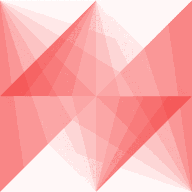

<!-- PROJECT SHIELDS -->
[![Version][version-shield]][version-url]
[![Commit][commit-shield]][commit-url]
[![Issues][issues-shield]][issues-url]
<!-- [![LinkedIn][linkedin-shield]][linkedin-url] -->

<!-- PROJECT LOGO -->
 

  

  <h3 align="center">detekt</h3>

  

    Facial Recognition System
     
    <a href="https://jordondueck.github.io/detekt/">Try Application</a>
    ·
    <a href="https://github.com/jordondueck/detekt/issues">Report Bug</a>
    ·
    <a href="https://github.com/jordondueck/detekt/issues">Request Feature</a>
  

<!-- TABLE OF CONTENTS -->
## Table of Contents

* [About the Project](#about-the-project)
  * [Built With](#built-with)
* [Roadmap](#roadmap)
* [Contact](#contact)
* [Acknowledgements](#acknowledgements)

<!-- ABOUT THE PROJECT -->
## About The Project

[![detekt Screen Shot][product-screenshot]](https://jordondueck.github.io/detekt/)

***detekt*** is a web application capable of detecting human faces within an image.

### Built With

* [React.js](https://reactjs.org/) - Front-end JavaScript library
* [Node.js](https://nodejs.org/) - JavaScript runtime environment
* [Express.js](https://expressjs.com/) - Node.js web application framework
* [Knex.js](https://knexjs.org/) - SQL query builder
* [PostgreSQL](https://www.postgresql.org/) - Relational database management system (RDBMS)
* [Clarifai Predict API](https://www.clarifai.com/models/face-detection-image-recognition-model-a403429f2ddf4b49b307e318f00e528b-detection) - Face detection model

<!-- ROADMAP -->
## Roadmap

* See the [Trello board](https://trello.com/b/mSeRGlfj) for a visual overview of the project.

* See the [open issues](https://github.com/jordondueck/detekt/issues) for a list of proposed features (and known issues).

<!-- CONTACT -->
## Contact

* LinkedIn - [https://linkedin.com/jordondueck](https://linkedin.com/jordondueck)

<!-- ACKNOWLEDGEMENTS -->
## Acknowledgements

* [Zero to Mastery](zero-to-mastery.github.io/) - online web development courses
* [Zachary Nelson @ unsplash.com](https://unsplash.com/@zacharytnelson) - example image

<!-- MARKDOWN LINKS & IMAGES -->
<!-- https://www.markdownguide.org/basic-syntax/#reference-style-links -->
[commit-shield]: https://img.shields.io/github/last-commit/jordondueck/detekt
[commit-url]: https://github.com/jordondueck/detekt/commits/master
[version-shield]: https://img.shields.io/github/package-json/v/jordondueck/detekt
[version-url]: https://github.com/jordondueck/detekt
[issues-shield]: https://img.shields.io/github/issues/jordondueck/detekt
[issues-url]: https://github.com/jordondueck/detekt/issues
[linkedin-shield]: https://img.shields.io/badge/-LinkedIn-black.svg?logo=linkedin&colorB=555
[linkedin-url]: https://linkedin.com/in/jordondueck
[product-screenshot]: images/detekt-preview.png
